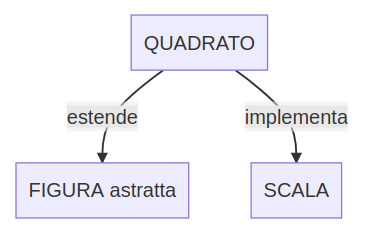
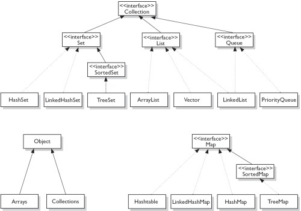
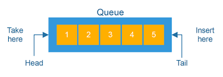
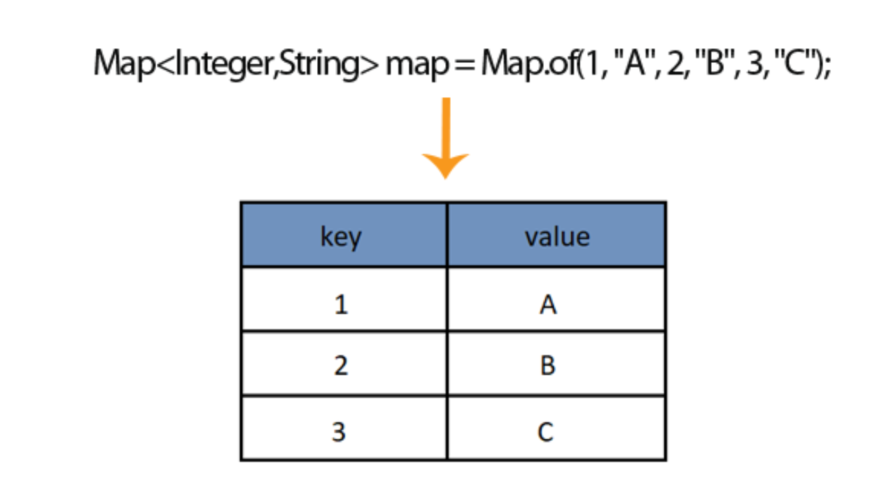
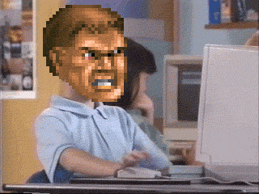

# Interfaccia e classe astratta
___
### Classe astratta

Definisce una interfaccia senza implementarla completamente.

Questo serve come base di partenza per generare una o più classi specializzate aventi tutte la stessa interfaccia di base, le quali potranno poi essere utilizzate indifferentemente (ovvero in modo polimorfico) da applicazioni che conoscono l'interfaccia base della classe astratta.
___
### Esempio espressione polimorfa
L'espressione **a + b** e' polimorfa dato che puo' indicare una somma fra `int` o `float` oppure una concatenazione per il tipo `String`
___
### Interfaccia

Una interfaccia in Java ha una struttura simile a una classe, ma può contenere **SOLO** costanti e metodi d'istanza astratti (quindi non può contenere né costruttori, né variabili statiche, né variabili di istanza, né metodi statici).
___
### Interfaccia 

```java
public interface Nome {
    public type metodo(Object o);
}
```
___
### Interfaccia java.lang.Comparable

```java
public interface Comparable {
    public int compareTo(Object o);
}
```
___
### Interfaccia
La classe Intero implementa Comparable.
```java
public class Main{
    public static class Intero implements Comparable {
        private int n;
        public Intero(int n) {
            this.n = n;
        }
        @Override
        public int compareTo(Object o){
            Intero int1 = (Intero) o;
            if (n < int1.n) return -1;
            else if (n > int1.n) return 1;
            else return 0;
        }
        public String toString() {
            return "" + n;
        }
    }

    public static void main(String[] args) {
        Intero intero = new Intero(1);
        int ris = intero.compareTo(new Intero(2));
        System.out.println(ris);
    }
}
```
```
output
-1
```
___

### interfacce
<p style="font-size:30px; text-align:left;"><strong>Nell'uso delle interfacce in un programma, ricordarsi delle seguenti regole:</strong></p>
<p style="font-size:30px; text-align:left;">- Possiamo dichiarare una variabile indicando come tipo un'interfaccia:</p>

```
Comparable cmp;
```
<p style="font-size:30px;text-align:left;">- Non possiamo istanziare un'interfaccia:</p>

```
Comparable com = new Comparable(); // VIETATO
```

<p style="font-size:30px;text-align:left;">- Ad una variabile di tipo interfaccia possiamo assegnare solo istanze di classi che implementano l'interfaccia:</p>

```
Comparable com = new Intero(5);
```

<p style="font-size:30px;text-align:left;">- Su di una variabile di tipo interfaccia possiamo invocare solo metodi dichiarati nell'interfaccia.</p>
___

### extends e implements

<p style="font-size:30px;text-align:left;">
- Ogni classe estende una sola altra classe (Object se non definito)<br><br>
- Una interfaccia può estendere una o più interfacce<br><br>
- La gerarchia di ereditarietà singola delle classi e la gerarchia di ereditarietà multipla delle interfacce sono completamente disgiunte.<br><br>
- Una classe può implemetare una o più interfacce.<br>In questo caso la classe implementatrice deve fornire una realizzazione per tutti i metodi delle interfacce che implementa, nonché per i metodi di eventuali super-interfacce da cui queste ereditano.<br>
</p>
___

### Esempio

___

# Let's code


---
#### Classi e le interfacce che permettono di gestire gruppi di oggetti

___

### Collection
<p style="font-size:30px;text-align:left;">Collection è l'interfaccia più generica, non definisce nè l'ordine in cui sono memorizzati gli elementi nè se ci possono essere elementi duplicati.<br>
A differenza degli Array tutte le collection non possono contenere tipi primitivi ma solamente oggetti, per inserire tipi primitivi è necessario usare un oggetto wrapper (Integer) </p>

```java
public void test(Collection c) {
	c.add(new Integer(1));
	c.add(new Integer(5));
	c.add(new Integer(7));
	c.remove(new Integer(5));
	System.out.println(c.size() == 2);
}
```
___
### List
L’interfaccia List che permette di gestire collezione di oggetti ordinati identificabili univocamente mediante un indice che rappresenta la sua posizione all’interno della lista
___
### Set
L’interfaccia Set che permette di gestire collezione di oggetti non duplicati identificabili univocamente mediante il metodo equals()
___
### Queue
L’interfaccia Queue che permette di gestire collezione di oggetti gestiti con la filosofia FIFO (first-in, first-out) in modo che il primo oggetto inserito sia il primo candidato ad essere letto.

___

### Map
L'interfaccia Map che permette di gestire collezioni di oggetti del tipo chiave, valore `<key, value>`.

___

### Esercizio riassuntivo
<p style="font-size:24px; text-align:left">
Scrivere un programma che suddivida un mazzo di carte da 1 a 5 e con semi Cuori, Quadri, Picche e Fiori (C, Q, P, F) nei seguenti gruppi:<br><br> 
- carte di cuori > 2<br>
- carte di cuori <= 2<br>
- carte di quadri<br>
- carte di picche <= 2 e fiori > 4<br>
- carte di fiori comprese tra 2 e 4 <br>
- altre carte<br><br>
Esempio di carte: 1C, 1Q, 1P, 1F<br><br>
<span style="color:red">Nota bene!!</span> <br>
Utilizzare i costrutti switch e for-each<br>Scorrere il mazzo di carte una sola volta.<br>Stampare alla fine tutte le suddivisioni.
</p>
___

# Let's code

___


---

# Fonti
<p style="font-size:30px;text-align:left;">
https://www.html.it/pag/403028/array-golang/<br>
https://www.html.it/pag/402224/golan-costrutti-condizionali-cicli/<br>
https://www.html.it/pag/62043/interfacce-collection-e-list-in-java/<br>
</p>
---

